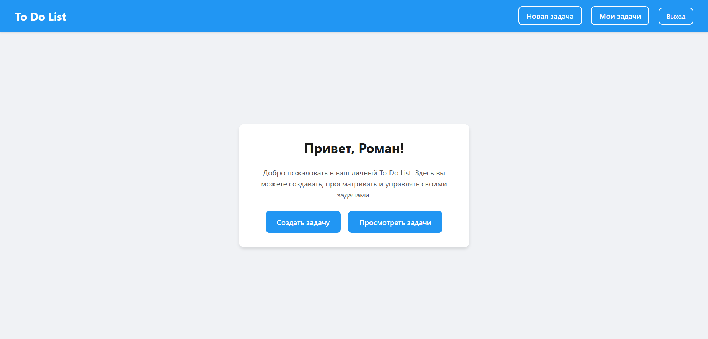
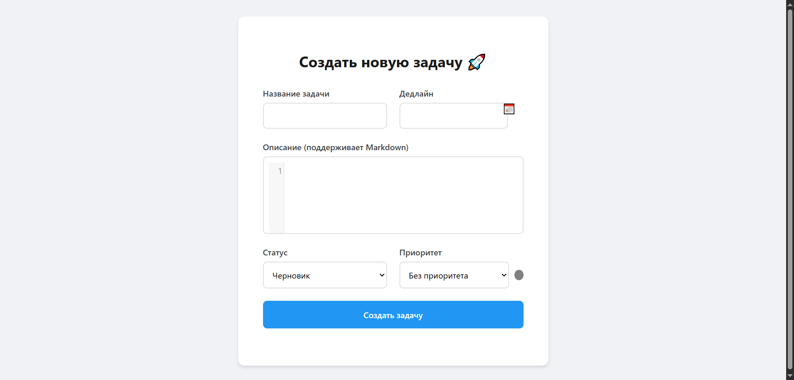
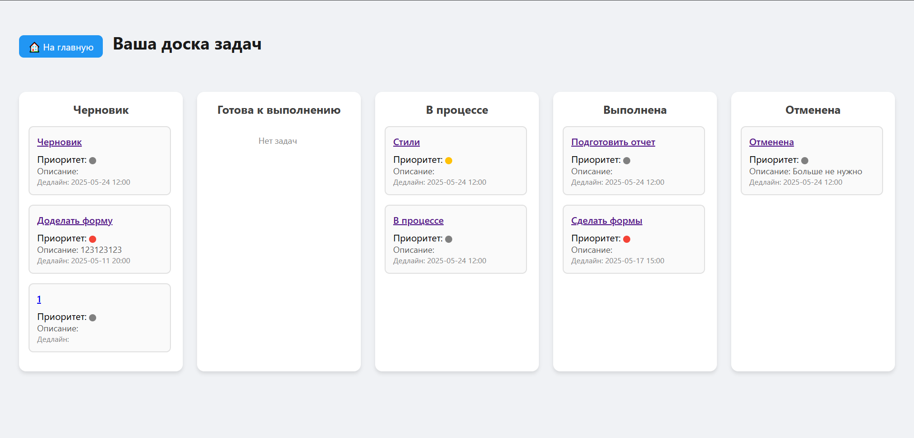
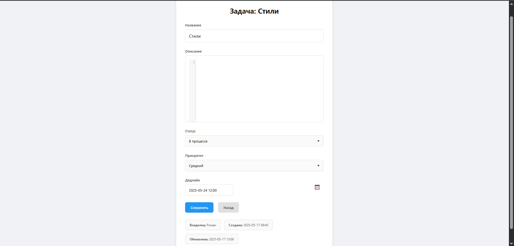

# To Do List Application

A simple, yet powerful, **Django**-based To Do List application that helps you manage tasks with ease. Features include:

* **Kanban-style Board**: View tasks grouped by status (Draft, Ready, In Progress, Completed, Canceled) in draggable columns.
* **Priority Indicators**: Color-coded priorities (None, Low, Medium, High) for quick visual cues.
* **Rich Text Description**: Markdown-supported task descriptions with live CodeMirror editor.
* **Date Picker**: Flatpickr-powered deadline selector with Russian localization.
* **Responsive & Accessible**: Modern, mobile-friendly design with semantic HTML.

---

## Table of Contents

* [Demo](#demo)
* [Features](#features)
* [Prerequisites](#prerequisites)
* [Installation](#installation)
* [Configuration](#configuration)
* [Usage](#usage)

---

## Demo

# Main page


# Create task


# Kanban board


# Task detail info

---

## Features

1. **Task Management**: Operations via Django forms.
2. **Kanban Board**: Tasks organized into columns by status.
3. **Priority Colors**: Easily spot task urgency with colored badges.
4. **Markdown Editor**: Integrated CodeMirror for writing rich descriptions.
5. **Calendar Picker**: Flatpickr for selecting deadlines with Russian locale.
6. **User Authentication**: Secure registration, login, and logout via Django's auth system.
7. **Responsive Design**: CSS grid and fluid layouts for desktop and mobile.

---

## Prerequisites

* Python 3.12+
* pip (or pipenv/virtualenv)
* PostgreSQL (or SQLite for development)

---

## Installation

1. **Clone the repository**

   ```bash
   git clone https://github.com/yourusername/todo-django-app.git
   cd todo-django-app
   ```

2. **Create and activate virtual environment**

   ```bash
   python -m venv venv
   source venv/bin/activate    # Linux/macOS
   venv\Scripts\activate     # Windows
   ```

3. **Install dependencies**

   ```bash
   pip install django, python-dotenv
   ```

---

## Configuration

1. **Environment variables**

   * Copy `.env.example` to `.env` and fill in your secret key, database credentials, etc.

2. **Database Migrations**

   ```bash
   python manage.py migrate
   ```

3. **Collect static files** (for production)

   ```bash
   python manage.py collectstatic
   ```

---

## Usage

1. **Run the development server**

   ```bash
   python manage.py runserver
   ```

2. **Open in browser**

   Visit `http://127.0.0.1:8000/` to view the home page.

3. **Register / Login**

   Create a user account or log in to start managing your tasks.

4. **Create a Task**

   Navigate to **New Task**, fill in details, and save.

5. **View Board**

   Click **My Tasks** to see the Kanban board. Drag cards to change status.

---